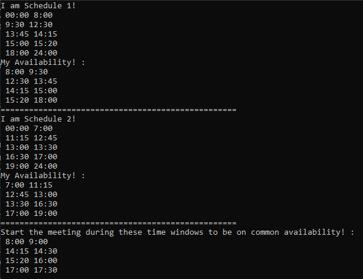

# meetingScheduler
Given two schedules find time for a meeting!

Each person's schedule consists of "not-meeting" periods where they choose to not have a meeting
for example, one may choose to not have meetings before 8:00 and after 19:00.

Their schedules then consist of other meetings or activities they may have going on during the day.

My program then calculates their available times and cross-references this with another person's schedule to find common availability.

Finally, given the parameter of "meeting duration" my program provides the range of times in which you can START the meeting and finish whilst being in the availability of BOTH party's schedules.

**Example with meeting duration of 30 minutes

